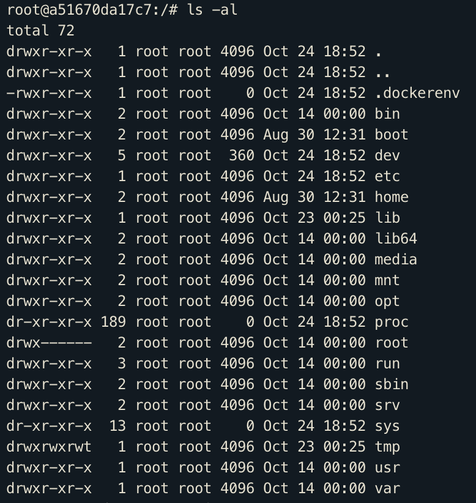

# What's going on inside containers

## Top commands

- `docker container top` - process list inside container
- `docker container inspect` - details of one container config
- `docker container stats` - performance stats for all containers

## Getting a shell inside Containers

- `docker container run -it` - starts new container interactively
- `docker container exec -it` - run additional command in existing container
- `docker container start -ai` - starts an existing container interactively

### Examples

`docker container run -it --name proxy nginx bash`

> Once exited from bash the container stopped because containers
> only runs as long as the command it ran on startup runs, so
> exiting bash quit it

`docker container exec -it mysql bash`

> After exit, container is still running, because exec
> runs additional process in existing container

